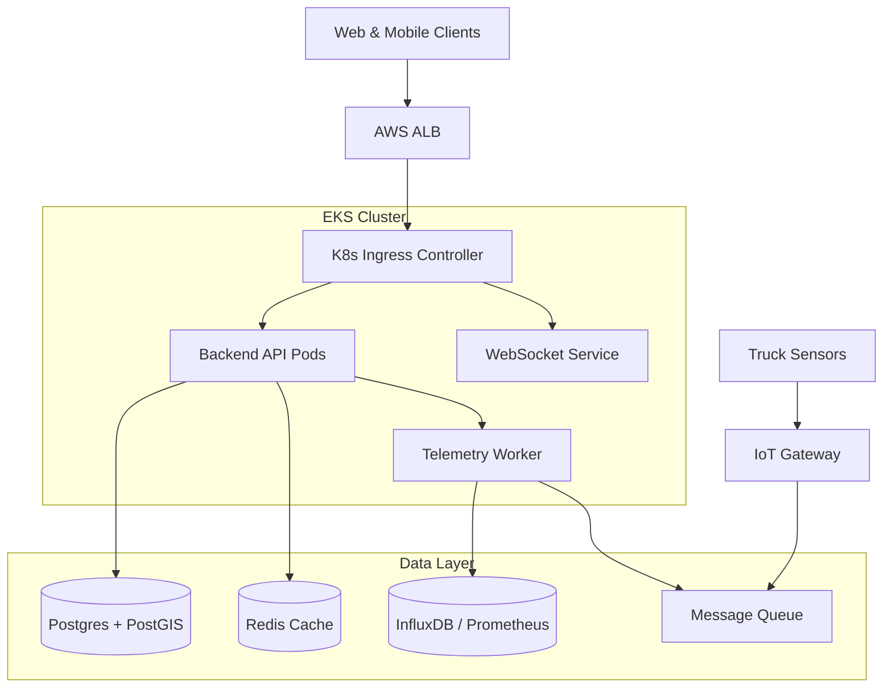
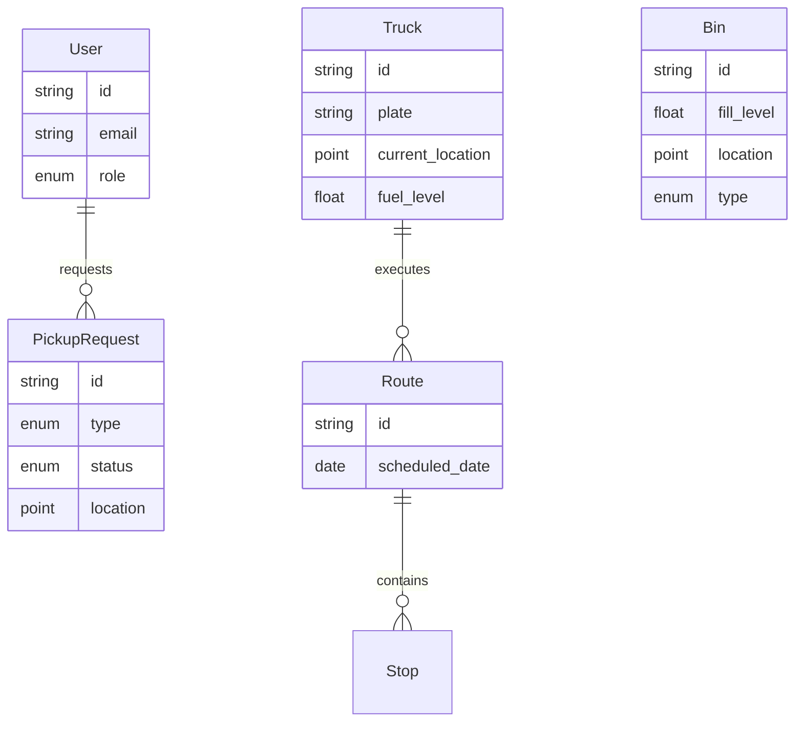

# System Architecture

## High-Level Overview

## Database Schema (ERD)

## Key Components

1. **Backend API**: RESTful service (Fastify) handling users, assets, and pickup CRUD.
2. **Telemetry Ingestion**: A separate worker service that consumes high-frequency GPS and sensor data from RabbitMQ/SQS and writes to TimescaleDB/InfluxDB.
3. **PostGIS**: Used for geospatial queries (e.g., "Find all bins within 5km of Truck A").
